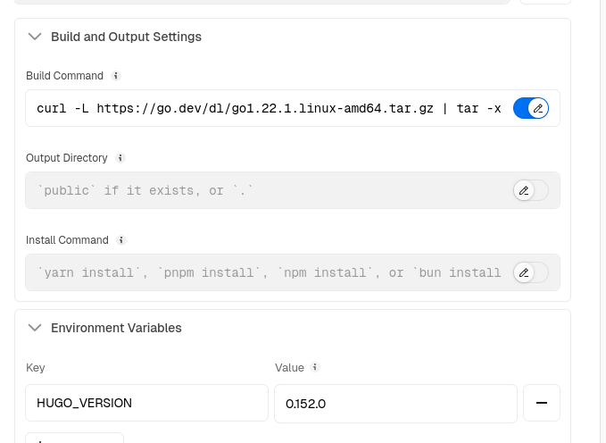
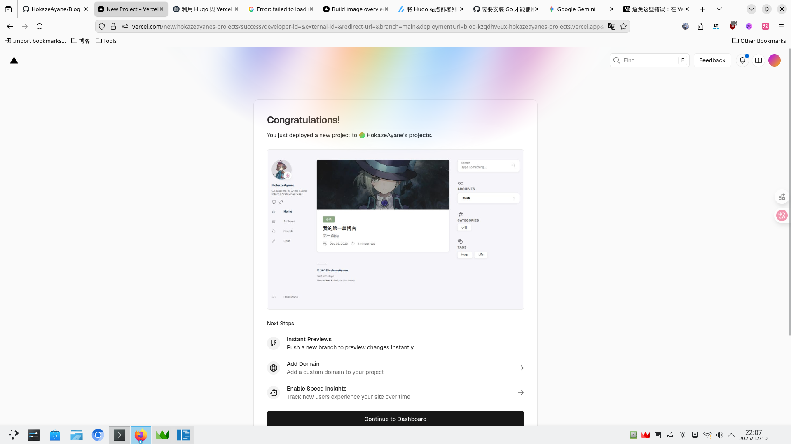

### ❌问题描述
明明项目根目录下有 `go.mod` 文件，我也在 Vercel 设置中选中了 **Hugo** 预设，并正确配置了 `HUGO_VERSION` 环境变量，但是构建时仍然出现错误：

```text
Error: failed to load modules: failed to download modules: binary with name "go" not found in PATH
Error: Command "hugo --gc" exited with 1
```
这说明 Vercel 的构建环境里找不到 Go，导致无法下载 Hugo Modules 依赖。
### ✅解决方案

#### 核心思路
既然 Vercel 默认环境没有 Go，那就在构建命令执行时，手动下载并安装 Go。
#### 操作步骤
请根据自己的实际情况替换下方的 Go 版本号（推荐使用 1.21 或更高版本）。
- 1.打开 Vercel 项目设置，进入 Build & Development。
- 2.在 Build Command (构建命令) 中开启 Override。
- 3.填入以下组合命令：
```
curl -L https://go.dev/dl/go1.22.1.linux-amd64.tar.gz | tar -xz && export PATH=$PWD/go/bin:$PATH && hugo --gc --minify
```

#### 配图：


#### 🔗参考资料
如果你有其他疑问 🤔，可以参考 Vercel 社区的这个讨论帖： [How to use Hugo Modules on Vercel](https://github.com/vercel/community/discussions/38)?

